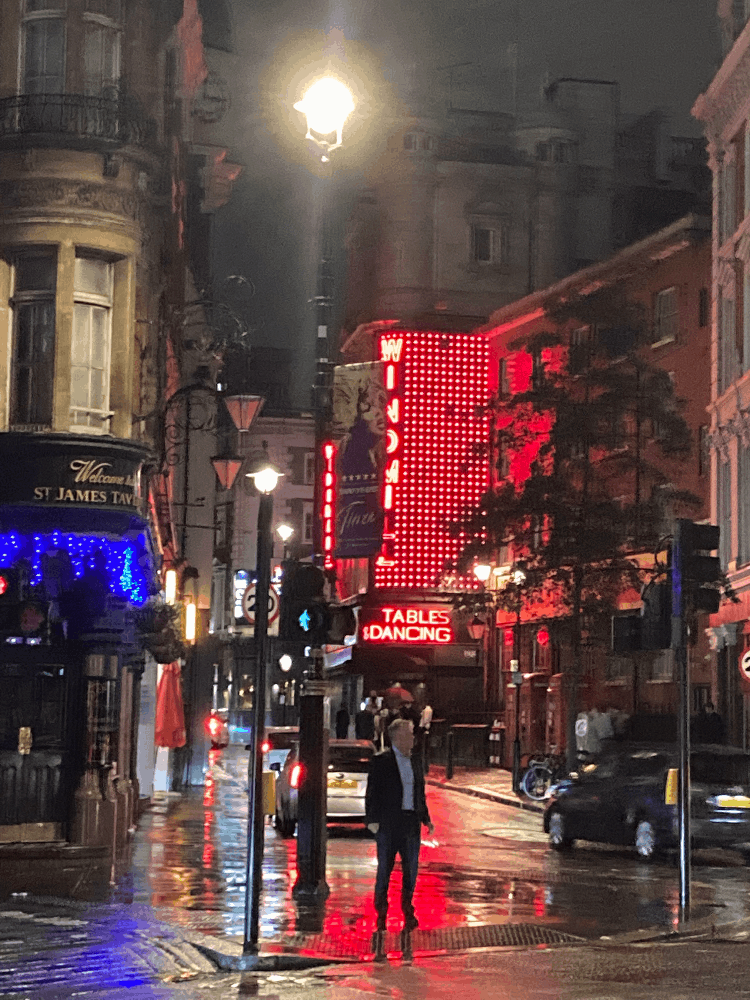

# 

### [Buy on Itch.io](https://flinkerflitzer.itch.io/painterly) | [Demo](https://github.com/jbunke/painterly/releases/latest) | [Documentation](./docs/README.md) | [Changelog](./res/text/en/changelog.md) | [Roadmap](./res/text/en/roadmap.md) | [License](./LICENSE.md)

<!-- TODO - video embed here -->

## Overview

*Painterly* is a Windows desktop program that turns images into digital paintings. It works via a [greedy algorithm](https://en.wikipedia.org/wiki/Greedy_algorithm), which attempts to make random brush strokes on the canvas, and only accepts them if they make the painting resemble the image it is painting more than it did before.

Upload your family photos, vacation shots, or anything you're curious to see painted and watch the magic unfold.

<em>51,750 brush strokes</em>

> **Note:** *Painterly* is not generative AI. It paints brush stroke by brush stroke. It takes minutes to hours to produce a high quality painting depending on (1) the size and complexity of the source image and (2) the level of detail you desire.

## Getting Started

The best way to get started with *Painterly* is to buy the program or download the demo and simply start experimenting. The best place to learn more about the program is the [documentation](./docs/README.md).

## Development

*Painterly* is currently in early access. The [roadmap](./res/text/en/roadmap.md) outlines the planned features that you can expect will be implemented by the time of the full release.

To see changes between release versions, please visit the [changelog](./res/text/en/changelog.md).

## Contributing

[Bug reports](https://github.com/jbunke/painterly/issues/new?template=bug_report.md) and [feature requests](https://github.com/jbunke/painterly/issues/new?template=feature_request.md) are welcome.

Please ensure you are running the latest version of *Painterly* in case something you are reporting has already been added or fixed in a more recent version. Please also read to through the [open issues](https://github.com/jbunke/painterly/issues) to ensure that the same bug or feature hasn't already been reported or requested, and consult the [roadmap](./res/text/en/roadmap.md) to see whether a feature is already planned.
